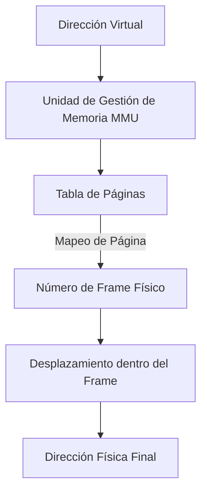
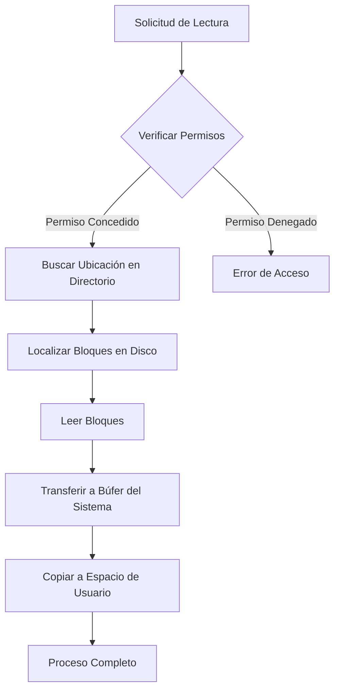

# Administración de Memoria

## 3.1 Política y Filosofía

### 1. Diferencia entre fragmentación interna y externa
La **fragmentación interna** ocurre cuando se asigna un bloque de memoria a un proceso, pero este no utiliza completamente el espacio asignado. Por ejemplo, si un proceso necesita 30 KB y el sistema le asigna un bloque de 32 KB, hay 2 KB desperdiciados dentro del bloque.

La **fragmentación externa**, en cambio, sucede cuando hay suficiente memoria libre en total, pero está fragmentada en bloques pequeños no contiguos que no son utilizables por un proceso debido a sus requisitos de tamaño.

**Impacto en el rendimiento:**
- **Interna:** Reduce la eficiencia al desperdiciar espacio dentro de los bloques asignados.
- **Externa:** Aumenta la dificultad para asignar memoria a procesos, lo que puede generar más overhead en la búsqueda de bloques contiguos.

---

### 2. Políticas de reemplazo de páginas
Las políticas de reemplazo de páginas son algoritmos que determinan qué página debe ser expulsada de la memoria física cuando se necesita cargar una nueva. Entre las más conocidas están:

- **FIFO (First-In, First-Out):** Se reemplaza la página más antigua en memoria.
- **LRU (Least Recently Used):** Se reemplaza la página que no ha sido usada durante más tiempo.
- **LFU (Least Frequently Used):** Se reemplaza la página con menos accesos.
- **NRU (Not Recently Used):** Basado en bits de referencia y modificación.

**¿Cuál es más eficiente?**
El algoritmo LRU suele ser el más eficiente en términos prácticos porque prioriza las páginas más recientemente usadas, lo que refleja mejor el comportamiento real de los procesos. Sin embargo, su implementación puede ser costosa en sistemas de gran escala.

---

## 3.2 Memoria Real

### 1. Programa en Python para simular particiones fijas
```python
class Memoria:
    def __init__(self, particiones):
        self.particiones = particiones
        self.ocupadas = [None] * len(particiones)

    def asignar_proceso(self, proceso, tamaño):
        for i, particion in enumerate(self.particiones):
            if self.ocupadas[i] is None and tamaño <= particion:
                self.ocupadas[i] = proceso
                return f"Proceso {proceso} asignado a partición {i}"
        return "No hay espacio disponible para este proceso"

    def liberar_proceso(self, proceso):
        for i, ocupado in enumerate(self.ocupadas):
            if ocupado == proceso:
                self.ocupadas[i] = None
                return f"Proceso {proceso} liberado de partición {i}"
        return "Proceso no encontrado"

# Ejemplo de uso
memoria = Memoria([50, 100, 200])
print(memoria.asignar_proceso("P1", 90))
print(memoria.asignar_proceso("P2", 50))
print(memoria.liberar_proceso("P1"))

```

## 3.3 Organización de Memoria Virtual

### 1. Paginación y segmentación
**Paginación:**
- Divide la memoria en bloques de tamaño fijo llamados páginas.
- **Ventajas:** 
  - Evita la fragmentación externa.
  - Facilita la administración de memoria.
- **Desventajas:** 
  - Genera fragmentación interna.
  - Aumenta el overhead en la gestión de la tabla de páginas.

**Segmentación:**
- Divide la memoria en bloques de tamaño variable llamados segmentos, que representan partes lógicas como código, datos y pila.
- **Ventajas:** 
  - Facilita la agrupación lógica de datos.
  - Permite un manejo más natural para los programadores.
- **Desventajas:** 
  - Puede generar fragmentación externa.
  - Complejidad adicional en la gestión de memoria.

**Comparación:**  
La **paginación** es preferida en sistemas modernos porque simplifica la administración, mientras que la **segmentación** ofrece un modelo más lógico para el programador, pero con mayores desafíos de fragmentación.

---

### 2. Programa para simular una tabla de páginas
```python
class TablaPaginas:
    def __init__(self, num_paginas):
        self.tabla = {i: None for i in range(num_paginas)}

    def asignar_pagina(self, pagina, marco):
        if self.tabla[pagina] is None:
            self.tabla[pagina] = marco
            print(f"Página {pagina} asignada al marco {marco}")
        else:
            print(f"La página {pagina} ya está asignada al marco {self.tabla[pagina]}")

    def mostrar_tabla(self):
        print("Tabla de páginas:")
        for pagina, marco in self.tabla.items():
            print(f"Página {pagina}: {'Libre' if marco is None else f'Marco {marco}'}")

# Ejemplo de uso
tabla = TablaPaginas(5)
tabla.asignar_pagina(0, 2)
tabla.asignar_pagina(1, 3)
tabla.mostrar_tabla()

```
## 3.4 Administración de Memoria Virtual

### 1. Implementación del algoritmo LRU (Least Recently Used)
```python
def lru(paginas, marcos):
    memoria = []
    fallos = 0

    for pagina in paginas:
        if pagina not in memoria:
            if len(memoria) < marcos:
                memoria.append(pagina)
            else:
                memoria.pop(0)  # Expulsar la página menos recientemente usada
                memoria.append(pagina)
            fallos += 1
        else:
            memoria.remove(pagina)
            memoria.append(pagina)
        print(f"Memoria actual: {memoria}")

    print(f"Fallos de página: {fallos}")

# Ejemplo
lru([1, 2, 3, 2, 1, 4, 5, 2, 1, 3], 3)
```

## 2. Diagrama de Traducción de Direcciones Virtuales a Físicas


### Explicación del Proceso de Traducción

1. **Dirección Virtual**
  - Entrada inicial al sistema de memoria virtual
  - Compuesta por dos partes:
    * Número de página virtual
    * Desplazamiento dentro de la página

2. **Unidad de Gestión de Memoria (MMU)**
  - Hardware especializado en traducción de direcciones
  - Realiza la conversión de direcciones virtuales a físicas
  - Maneja los mecanismos de paginación

3. **Tabla de Páginas**
  - Estructura de datos que mantiene el mapeo
  - Almacena correspondencias entre:
    * Páginas virtuales
    * Marcos de memoria física

4. **Número de Frame Físico**
  - Ubicación real en memoria física
  - Resultado de la búsqueda en la tabla de páginas

5. **Desplazamiento**
  - Mantiene la posición exacta dentro del marco
  - Permanece constante durante la traducción

6. **Dirección Física Final**
  - Ubicación precisa en memoria física
  - Resultado de combinar frame físico y desplazamiento

### Código de Ejemplo en Python

```python
class VirtualMemoryTranslator:
   def __init__(self, page_size=4096):
       self.page_size = page_size
       self.page_table = {}
   
   def map_page(self, virtual_page, physical_frame):
       """Mapea una página virtual a un frame físico"""
       self.page_table[virtual_page] = physical_frame
   
   def translate_address(self, virtual_address):
       """Traduce una dirección virtual a física"""
       # Calcular número de página y desplazamiento
       virtual_page = virtual_address // self.page_size
       offset = virtual_address % self.page_size
       
       # Verificar si la página está mapeada
       if virtual_page not in self.page_table:
           raise PageFaultException(f"Página {virtual_page} no mapeada")
       
       # Obtener frame físico
       physical_frame = self.page_table[virtual_page]
       
       # Calcular dirección física
       physical_address = (physical_frame * self.page_size) + offset
       
       return physical_address

# Ejemplo de uso
translator = VirtualMemoryTranslator()
translator.map_page(0, 10)  # Página virtual 0 -> Frame físico 10
translator.map_page(1, 15)  # Página virtual 1 -> Frame físico 15

try:
   # Traducir dirección virtual 5000
   physical_addr = translator.translate_address(5000)
   print(f"Dirección Virtual: 5000")
   print(f"Dirección Física: {physical_addr}")
except Exception as e:
   print(e)
```
## Integración

### 1. Análisis de Administración de Memoria Virtual en Linux

Linux utiliza un sistema avanzado de memoria virtual basado en paginación con las siguientes características clave:

1. **Paginación de dos niveles:**  
   Permite manejar grandes espacios de direcciones virtuales. La tabla de páginas se divide en niveles, reduciendo el overhead de mantener una tabla de páginas completa en sistemas con alta capacidad de memoria.

2. **Soporte para memoria no contigua:**  
   Los procesos pueden ocupar páginas físicas no contiguas, facilitando el uso eficiente de la memoria disponible y eliminando problemas de fragmentación externa.

3. **Implementación de swapping:**  
   Cuando la memoria física está cerca de saturarse, el kernel mueve páginas inactivas al espacio de swap en disco, liberando memoria para tareas activas.

4. **Uso de memoria caché:**  
   Las páginas de datos frecuentemente accedidas se almacenan temporalmente en caché para acelerar el acceso, reduciendo la latencia y el número de fallos de página.

Este modelo asegura una gestión eficiente y escalable de la memoria en sistemas modernos.

---

### 2. Simulación de Swapping de Procesos
A continuación, un programa en Python que simula la funcionalidad básica de swapping:

```python
class SwappingSimulator:
    def __init__(self, total_memory, swap_space):
        self.memory = {}
        self.swap_space = {}
        self.total_memory = total_memory
        self.swap_size = swap_space
    
    def load_process(self, process_id, process_size):
        memory_used = sum(self.memory.values())
        if memory_used + process_size > self.total_memory:
            print(f"Memoria insuficiente para cargar el proceso {process_id}. Realizando swapping...")
            self.swap_out_process()
        
        self.memory[process_id] = process_size
        print(f"Proceso {process_id} cargado en memoria. Memoria usada: {sum(self.memory.values())}/{self.total_memory}")
    
    def swap_out_process(self):
        if not self.memory:
            print("No hay procesos en memoria para hacer swapping.")
            return
        
        # Estrategia simple: sacar el proceso más antiguo
        oldest_process = next(iter(self.memory))
        process_size = self.memory[oldest_process]
        
        # Mover a espacio de swap
        self.swap_space[oldest_process] = process_size
        del self.memory[oldest_process]
        print(f"Proceso {oldest_process} movido a espacio de swap. Espacio de swap usado: {sum(self.swap_space.values())}/{self.swap_size}")
    
    def show_status(self):
        print("\nEstado actual:")
        print(f"Memoria: {self.memory}")
        print(f"Swap: {self.swap_space}\n")

# Ejemplo de uso
swapper = SwappingSimulator(total_memory=1024, swap_space=2048)
swapper.load_process(1, 300)
swapper.load_process(2, 400)
swapper.load_process(3, 500)
swapper.show_status()
swapper.load_process(4, 300)
swapper.show_status()
```
# Administración de Entrada/Salida

## 4.1 Dispositivos y Manejadores de Dispositivos

### 1. Diferencia entre Dispositivos de Bloque y Dispositivos de Carácter

**Dispositivos de Bloque:**
- **Características:**
  - Almacenan y transfieren datos en bloques de tamaño fijo.
  - Permiten acceso aleatorio a los datos.
- **Ejemplos:**
  - Discos duros.
  - Unidades SSD.
  - Memorias USB.

**Dispositivos de Carácter:**
- **Características:**
  - Transfieren datos carácter por carácter.
  - Acceso secuencial.
  - No permiten búsquedas o accesos aleatorios.
- **Ejemplos:**
  - Impresoras.
  - Terminales.
  - Módems.
  - Puertos serie.

---

### 2. Manejador de Dispositivos Virtual de Entrada

A continuación, se presenta una implementación básica en Python de un manejador de dispositivos virtual de entrada:

```python
class DeviceDriver:
    def __init__(self, device_name):
        self.device_name = device_name
        self.buffer = []
        self.is_open = False
    
    def open_device(self):
        if not self.is_open:
            print(f"Abriendo dispositivo: {self.device_name}")
            self.is_open = True
    
    def close_device(self):
        if self.is_open:
            print(f"Cerrando dispositivo: {self.device_name}")
            self.is_open = False
    
    def read_input(self, data):
        if self.is_open:
            self.buffer.append(data)
            print(f"Dato leído en {self.device_name}: {data}")
        else:
            print("Error: Dispositivo no está abierto")
    
    def get_buffer(self):
        return self.buffer

# Ejemplo de uso
keyboard_driver = DeviceDriver("Teclado Virtual")
keyboard_driver.open_device()
keyboard_driver.read_input("Hola")
keyboard_driver.read_input("Mundo")
print(keyboard_driver.get_buffer())
keyboard_driver.close_device()
```
## 4.2 Mecanismos y Funciones de Manejadores de Dispositivos

### 1. Interrupción por E/S

Cuando un dispositivo necesita realizar una operación de entrada/salida (E/S), genera una **interrupción** que notifica al sistema operativo. El manejador de interrupciones se encarga de gestionar esta señal y realizar las acciones necesarias. A continuación, se presenta un pseudocódigo que ilustra este proceso:

```plaintext
Función manejarInterrupcionES(tipoInterrupcion):
    Según tipoInterrupcion:
        Caso LECTURA:
            Guardar contexto del proceso actual
            Transferir datos desde dispositivo a memoria
            Actualizar estado del proceso (marcar como listo)
            Restaurar contexto del proceso interrumpido
        
        Caso ESCRITURA:
            Guardar contexto del proceso actual
            Transferir datos desde memoria a dispositivo
            Actualizar estado del proceso (marcar como en espera)
            Restaurar contexto del proceso interrumpido
        
        Caso ERROR:
            Registrar información de error
            Notificar al sistema operativo
            Tomar acción correctiva (reintentar o abortar operación)
```
### 2. Manejo de Interrupciones en un Sistema de Simulación

A continuación, se presenta un programa en Python que implementa un sistema básico para manejar interrupciones generadas por dispositivos:

```python
import time

class InterruptionHandler:
    def __init__(self):
        self.interrupt_queue = []  # Cola para almacenar las interrupciones
    
    def register_interrupt(self, interrupt_type, device, data=None):
        """Registra una nueva interrupción en la cola."""
        interrupt = {
            'type': interrupt_type,
            'device': device,
            'data': data,
            'timestamp': time.time()  # Marca temporal para la interrupción
        }
        self.interrupt_queue.append(interrupt)
        print(f"Interrupción registrada: {interrupt_type} en {device}")
    
    def process_interrupts(self):
        """Procesa las interrupciones en la cola una por una."""
        while self.interrupt_queue:
            interrupt = self.interrupt_queue.pop(0)
            if interrupt['type'] == 'READ':
                print(f"Procesando interrupción de lectura en {interrupt['device']}")
                # Aquí se incluiría la lógica específica para manejar la lectura
            
            elif interrupt['type'] == 'WRITE':
                print(f"Procesando interrupción de escritura en {interrupt['device']}")
                # Aquí se incluiría la lógica específica para manejar la escritura
            
            elif interrupt['type'] == 'ERROR':
                print(f"Manejando error en {interrupt['device']}")
                # Aquí se incluiría la lógica específica para manejar errores
            
            print(f"Interrupción procesada: {interrupt}")

# Ejemplo de uso
handler = InterruptionHandler()
handler.register_interrupt('READ', 'Disco Duro')
handler.register_interrupt('WRITE', 'Impresora', data="Documento.pdf")
handler.register_interrupt('ERROR', 'Teclado')

# Procesar las interrupciones registradas
handler.process_interrupts()
```
## 4.3 Estructuras de Datos para Manejo de Dispositivos

### 1. Cola de E/S con Prioridad

El manejo de solicitudes de entrada/salida (E/S) puede optimizarse mediante el uso de una **cola con prioridad**, donde las solicitudes más importantes se procesan primero. A continuación, se presenta una implementación de una cola de E/S con prioridad en Python:

```python
import heapq

class PriorityIOQueue:
    def __init__(self):
        self.queue = []  # Cola de prioridad implementada como un heap
        self.counter = 0  # Contador para desambiguar prioridades iguales
    
    def add_request(self, request, priority):
        """
        Agrega una nueva solicitud a la cola de E/S con prioridad.
        :param request: Descripción de la solicitud.
        :param priority: Prioridad de la solicitud (menor valor = mayor prioridad).
        """
        heapq.heappush(self.queue, (priority, self.counter, request))
        self.counter += 1
    
    def get_next_request(self):
        """
        Devuelve y elimina la siguiente solicitud de mayor prioridad de la cola.
        :return: Solicitud de E/S o None si la cola está vacía.
        """
        if self.queue:
            return heapq.heappop(self.queue)[2]
        return None
    
    def is_empty(self):
        """
        Verifica si la cola de solicitudes está vacía.
        :return: True si la cola está vacía, False en caso contrario.
        """
        return len(self.queue) == 0

# Ejemplo de uso
io_queue = PriorityIOQueue()
io_queue.add_request("Lectura Archivo 1", 2)  # Prioridad media
io_queue.add_request("Escritura Archivo 2", 1)  # Alta prioridad
io_queue.add_request("Lectura Configuración", 3)  # Baja prioridad

print("Procesando solicitudes de E/S en orden de prioridad:")
while not io_queue.is_empty():
    print(io_queue.get_next_request())
```
### 2. Tabla de Estructuras del Manejador de Dispositivos

En un sistema operativo, los manejadores de dispositivos administran información sobre los dispositivos conectados. Esta implementación utiliza una tabla para registrar dispositivos, sus estados y las operaciones realizadas. A continuación, se presenta un programa en Python que simula una tabla de estructuras para manejar dispositivos:

```python
import time

class DeviceHandlerTable:
    def __init__(self):
        self.devices = {}  # Diccionario para almacenar información de los dispositivos
    
    def register_device(self, device_id, device_type, status):
        """
        Registra un nuevo dispositivo en la tabla.
        :param device_id: Identificador único del dispositivo.
        :param device_type: Tipo de dispositivo (ej. 'HDD', 'SSD', 'Printer').
        :param status: Estado actual del dispositivo (ej. 'ACTIVE', 'INACTIVE').
        """
        self.devices[device_id] = {
            'type': device_type,
            'status': status,
            'operations': [],
            'last_access': None
        }
        print(f"Dispositivo {device_id} registrado con tipo {device_type} y estado {status}")
    
    def log_operation(self, device_id, operation_type):
        """
        Registra una operación realizada por el dispositivo.
        :param device_id: Identificador del dispositivo.
        :param operation_type: Tipo de operación (ej. 'READ', 'WRITE').
        """
        if device_id in self.devices:
            self.devices[device_id]['operations'].append({
                'type': operation_type,
                'timestamp': time.time()
            })
            self.devices[device_id]['last_access'] = time.time()
            print(f"Operación {operation_type} registrada en {device_id}")
        else:
            print(f"Error: Dispositivo {device_id} no encontrado.")
    
    def get_device_info(self, device_id):
        """
        Obtiene la información completa del dispositivo.
        :param device_id: Identificador del dispositivo.
        :return: Información del dispositivo o None si no existe.
        """
        return self.devices.get(device_id, None)

# Ejemplo de uso
device_table = DeviceHandlerTable()
device_table.register_device('disk1', 'HDD', 'ACTIVE')
device_table.log_operation('disk1', 'READ')
device_table.log_operation('disk1', 'WRITE')
print("\nInformación del dispositivo 'disk1':")
print(device_table.get_device_info('disk1'))
```
## 4.4 Operaciones de Entrada/Salida

### 1. Flujo de Lectura de Archivo desde Disco Magnético

El siguiente diagrama describe el proceso de lectura de un archivo desde un disco magnético:


## 4.4 Operaciones de Entrada/Salida

### 2. Operaciones de E/S Asíncronas con Archivos en Python

El siguiente programa implementa un sistema de entrada/salida asíncrona utilizando Python y la librería `asyncio`. Este enfoque permite que las operaciones de lectura y escritura no bloqueen la ejecución del programa, lo que es ideal para aplicaciones que requieren alta concurrencia.

#### Código de Implementación

```python
import asyncio
import aiofiles

class AsyncFileIO:
    async def read_file_async(self, filename):
        """
        Lee un archivo de forma asíncrona.
        :param filename: Nombre del archivo a leer.
        :return: Contenido del archivo.
        """
        try:
            async with aiofiles.open(filename, mode='r') as file:
                content = await file.read()
                return content
        except IOError as e:
            print(f"Error de lectura: {e}")
    
    async def write_file_async(self, filename, data):
        """
        Escribe datos en un archivo de forma asíncrona.
        :param filename: Nombre del archivo a escribir.
        :param data: Contenido a escribir en el archivo.
        """
        try:
            async with aiofiles.open(filename, mode='w') as file:
                await file.write(data)
                print(f"Escritura completada en {filename}")
        except IOError as e:
            print(f"Error de escritura: {e}")

# Ejemplo de uso con asyncio
async def main():
    file_io = AsyncFileIO()
    # Escritura asíncrona
    await file_io.write_file_async('ejemplo.txt', 'Contenido asíncrono')
    # Lectura asíncrona
    contenido = await file_io.read_file_async('ejemplo.txt')
    print(contenido)

asyncio.run(main())
```
## Integración

### 1. Algoritmo de Planificación de Discos - Elevator (SCAN)

El algoritmo *Elevator* (también conocido como SCAN) es una técnica de planificación de discos que mueve el cabezal en una dirección hasta alcanzar el extremo antes de cambiar de sentido, similar al funcionamiento de un elevador.

#### Código de Implementación

```python
def elevator_scan(requests, initial_position, direction):
    """
    Implementa el algoritmo de planificación de discos Elevator (SCAN).
    :param requests: Lista de solicitudes de posición.
    :param initial_position: Posición inicial del cabezal.
    :param direction: Dirección inicial ('hacia_derecha' o 'hacia_izquierda').
    :return: Camino recorrido y movimiento total.
    """
    requests.sort()
    current_position = initial_position
    path = [current_position]
    total_movement = 0

    if direction == 'hacia_derecha':
        # Procesar solicitudes en la dirección actual
        for req in requests:
            if req >= current_position:
                total_movement += abs(req - current_position)
                current_position = req
                path.append(current_position)
        
        # Cambiar dirección
        for req in reversed(requests):
            if req < current_position:
                total_movement += abs(req - current_position)
                current_position = req
                path.append(current_position)

    elif direction == 'hacia_izquierda':
        # Procesar solicitudes en la dirección actual
        for req in reversed(requests):
            if req <= current_position:
                total_movement += abs(req - current_position)
                current_position = req
                path.append(current_position)
        
        # Cambiar dirección
        for req in requests:
            if req > current_position:
                total_movement += abs(req - current_position)
                current_position = req
                path.append(current_position)

    return path, total_movement

# Ejemplo de uso
requests = [82, 170, 43, 140, 24, 16, 190]
initial_position = 50
direction = 'hacia_derecha'

path, movement = elevator_scan(requests, initial_position, direction)
print(f"Camino recorrido: {path}")
print(f"Movimiento total: {movement}")
```
## Integración

### 2. Sistema de Comunicación entre Dispositivos Simulados

Este sistema simula un bus de comunicación para coordinar la interacción entre varios dispositivos, como un disco duro, impresora y teclado, representados como objetos en Python. Utiliza una arquitectura sencilla basada en mensajes para simular la comunicación.

#### Código de Implementación

```python
class Device:
    def __init__(self, name):
        """
        Inicializa un dispositivo con un nombre y sin conexión a un bus de comunicación.
        :param name: Nombre del dispositivo.
        """
        self.name = name
        self.communication_bus = None
    
    def connect_to_bus(self, bus):
        """
        Conecta el dispositivo a un bus de comunicación.
        :param bus: Instancia de CommunicationBus.
        """
        self.communication_bus = bus
    
    def send_message(self, message):
        """
        Envía un mensaje a través del bus de comunicación.
        :param message: Mensaje a enviar.
        """
        if self.communication_bus:
            self.communication_bus.broadcast(self, message)
    
    def receive_message(self, sender, message):
        """
        Recibe un mensaje desde otro dispositivo.
        :param sender: Dispositivo que envía el mensaje.
        :param message: Contenido del mensaje.
        """
        print(f"{self.name} recibió mensaje de {sender.name}: {message}")

class CommunicationBus:
    def __init__(self):
        """
        Inicializa un bus de comunicación sin dispositivos registrados.
        """
        self.devices = []
    
    def register_device(self, device):
        """
        Registra un dispositivo en el bus de comunicación.
        :param device: Instancia de Device a registrar.
        """
        self.devices.append(device)
        device.connect_to_bus(self)
    
    def broadcast(self, sender, message):
        """
        Envía un mensaje a todos los dispositivos conectados, excepto al remitente.
        :param sender: Dispositivo que envía el mensaje.
        :param message: Contenido del mensaje.
        """
        for device in self.devices:
            if device != sender:
                device.receive_message(sender, message)

# Ejemplo de uso
bus = CommunicationBus()
hard_disk = Device("Disco Duro")
printer = Device("Impresora")
keyboard = Device("Teclado")

bus.register_device(hard_disk)
bus.register_device(printer)
bus.register_device(keyboard)

keyboard.send_message("Hola, dispositivos!")
```
## Avanzados: Optimización de E/S con Memoria Caché

### Optimización de Operaciones de E/S con Memoria Caché

La memoria caché juega un papel crucial en la optimización de las operaciones de Entrada/Salida (E/S) al almacenar datos frecuentemente accedidos en una memoria de alta velocidad. Esto reduce la latencia de acceso a dispositivos de almacenamiento más lentos, mejorando el rendimiento global del sistema. A continuación se describen las estrategias y beneficios clave en la optimización de E/S mediante el uso de caché.

#### Estrategias de Caché

1. **Caché de Lectura Anticipada (Prefetching):**
   - **Descripción:** La caché de lectura anticipada predice qué datos serán necesarios próximamente y los carga en la memoria caché antes de que se soliciten, minimizando así el tiempo de espera cuando se accede a ellos.
   - **Beneficios:** 
     - Mejora la eficiencia al reducir los accesos a los dispositivos de almacenamiento.
     - Ayuda a optimizar la latencia en operaciones de lectura.

2. **Escritura Diferida (Write-Back):**
   - **Descripción:** En lugar de escribir directamente en el dispositivo de almacenamiento, los datos se escriben primero en la caché. La escritura en el dispositivo de almacenamiento se realiza de manera diferida, cuando el sistema lo considera adecuado o cuando se libera espacio en la caché.
   - **Beneficios:** 
     - Mejora el rendimiento al reducir las escrituras repetidas en dispositivos lentos.
     - Minimiza el desgaste de los dispositivos de almacenamiento (como SSDs) al reducir la cantidad de escrituras.

3. **Caché de Múltiples Niveles:**
   - **Descripción:** Se utiliza una jerarquía de caché, que puede incluir niveles como L1, L2 y L3, donde L1 es la caché más cercana al procesador, pero también la más pequeña, mientras que L3 es más grande pero más lenta. Los datos más frecuentemente utilizados se almacenan en los niveles más cercanos al procesador.
   - **Beneficios:**
     - Aumenta la eficiencia del sistema al permitir que los datos se almacenen en cachés de diferentes niveles según la frecuencia de acceso.
     - Reduce la latencia de acceso a los datos, optimizando tanto las operaciones de lectura como de escritura.

#### Beneficios Generales de la Optimización de E/S con Memoria Caché

- **Mejora en el rendimiento de las operaciones de E/S:**
  - El acceso a los datos es mucho más rápido desde la caché, lo que mejora el rendimiento global del sistema.
  
- **Reducción de la cantidad de accesos a dispositivos de almacenamiento lentos:**
  - Al almacenar los datos más frecuentemente utilizados en la memoria caché, se reduce la necesidad de acceder repetidamente a dispositivos de almacenamiento más lentos, como discos duros o incluso SSDs.

- **Menor latencia y mayor eficiencia:**
  - Las operaciones de E/S se realizan más rápidamente, lo que resulta en una mejora significativa de la experiencia del usuario y de la capacidad de respuesta del sistema.

#### Aplicaciones en Sistemas Operativos Modernos

Los sistemas operativos modernos, como **Linux** y **Windows**, emplean estas técnicas de caché para optimizar el rendimiento de E/S. En Linux, por ejemplo, la caché de página (page cache) almacena los datos leídos de archivos para que las futuras lecturas sean más rápidas. Además, se utilizan algoritmos sofisticados para la gestión de caché, como el algoritmo de reemplazo **LRU** (Least Recently Used), que decide qué datos deben ser conservados en la caché.

#### Conclusión

El uso de memoria caché en operaciones de E/S es una estrategia esencial para mejorar el rendimiento y reducir la latencia en sistemas modernos. Las técnicas de caché de lectura anticipada, escritura diferida y caché de múltiples niveles son fundamentales para optimizar las interacciones con dispositivos de almacenamiento y garantizar una experiencia más rápida y eficiente para el usuario.
